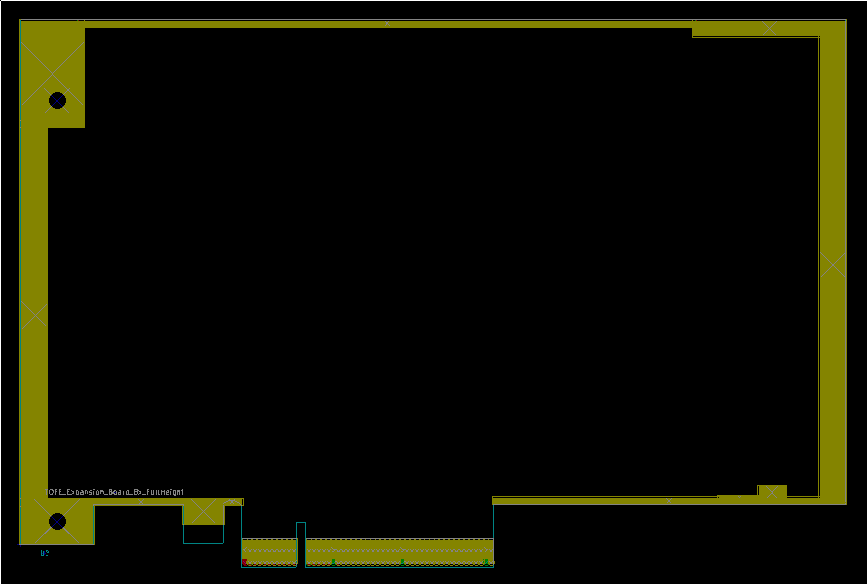
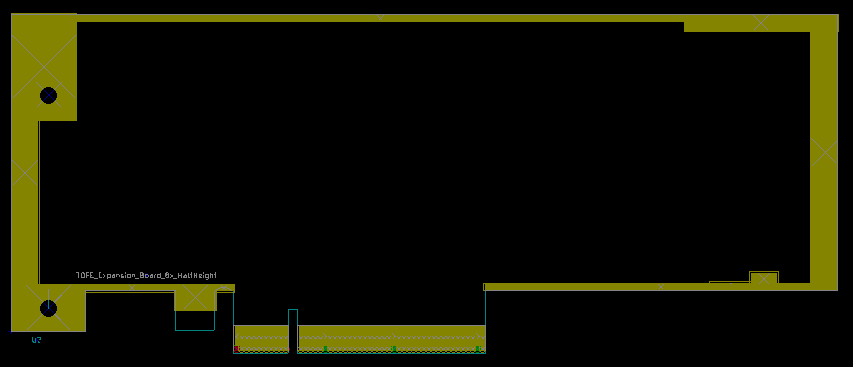

# TOFE Expansion Board Template for KiCad

This repository contains a template for creating TOFE expansion boards.

For [more information on the TOFE interface, see the HDMI2USB website](http://hdmi2usb.tv/tofe).
For the [KiCad website](http://kicad-pcb.org/) for more information on using it.

## Using

 1. Fork the github repo at [timvideos/HDMI2USB-TOFE-kicad-template](https://github.com/timvideos/HDMI2USB-TOFE-kicad-template)
 2. Rename your repository in the GitHub settings.
 3. Create your schematic based on provided KiCad schematic.
 4. Choose either the full height or half height ("low profile") PCB layout.
 5. (optional) Send [mithro](mailto:mithro@mithis.com) about your awesome work!

 * Your schematic should include an EEPROM (either real or emulated) on the
   ID_CLK and ID_DAT lines.
 * Your schematic should include a TOFE header.

## Board Design

The TOFE specification is very flexible regarding board shape. See the
following image for the many potential designs;

For full details on the TOFE mechanical specification, see the
[mechanical](http://hdmi2usb.tv/tofe#mechanical) part of the specification.

#### Full Height Board

#### Half Height Board

## KiCad

The design in this repository was made using [KiCad](http://www.kicad-pcb.org/)
version **2013-07-07 BZR 4022**
([the version is Ubuntu Trusty](http://packages.ubuntu.com/trusty/kicad)).

## License

TOFE Expansion Board template for KiCad by Numato Systems Pvt. Ltd

The TOFE Expansion Board template for KiCad is licensed under a 
Creative Commons Attribution 4.0 International License.

You should have received a copy of the license along with this
work.  If not, see <http://creativecommons.org/licenses/by/4.0/>.

